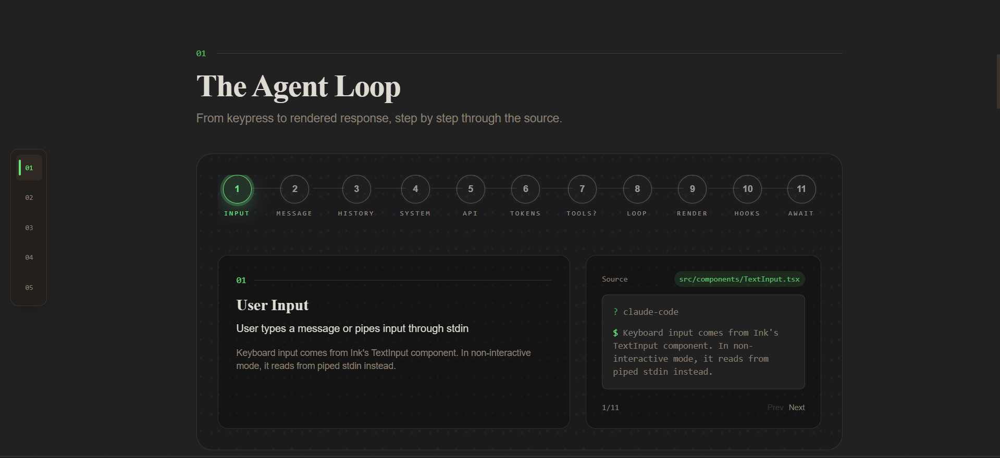
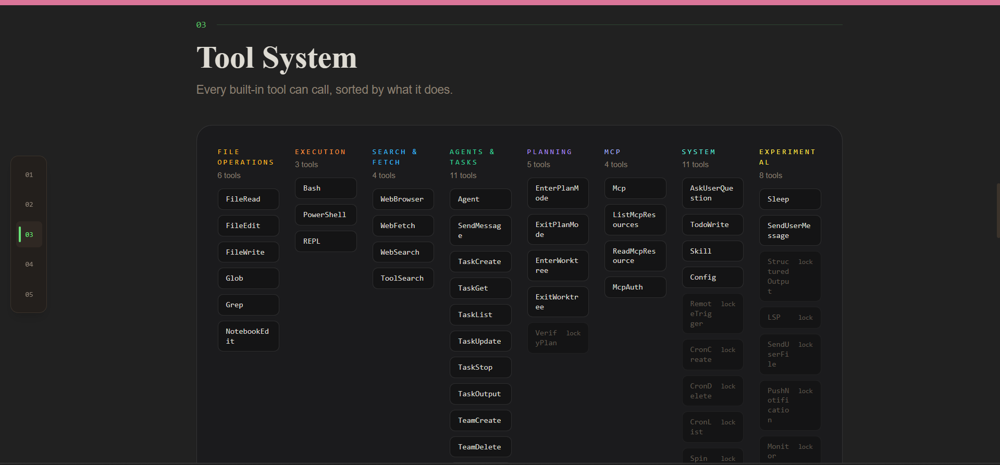
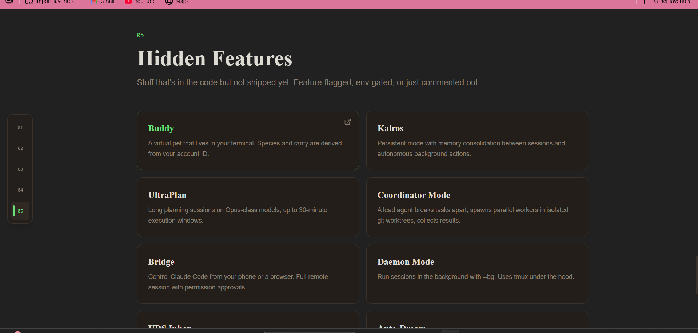
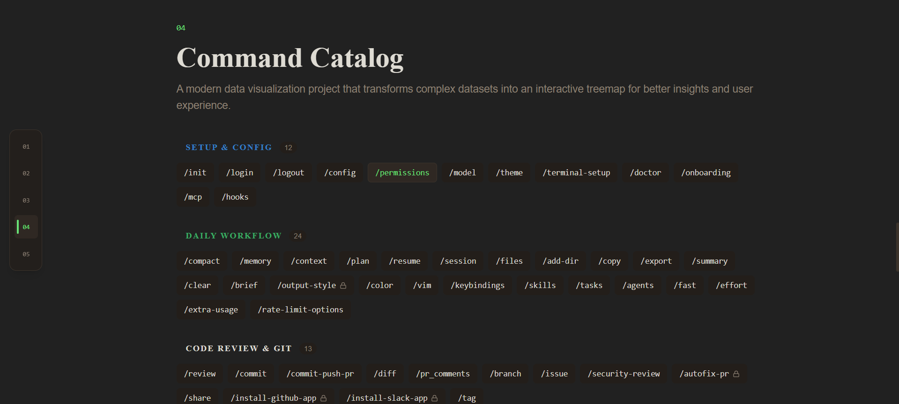

Project : An interactive data visualization platform inspired by ccunpacked.dev, enhanced with improved UI, performance, and additional features.

This project is a recreation and enhancement of an existing data visualization platform.
It focuses on presenting complex datasets using an interactive treemap interface for better insights and usability.

Features:

Interactive Treemap Visualization
Dynamic Data Rendering
Clean and Responsive UI
Optimized Performance
Improved User Experience
Mobile-Friendly Design

Frontend: React.js / Next.js
Visualization: D3.js
Styling: CSS / Tailwind (if used)

Screenshots: 

### Home Page

### Treemap 

### Agent

### Tool System

### Hidden Features

### Command Line

Clone the repository:

git clone https://github.com/your-username/cc-unpacked-enhanced.git
cd cc-unpacked-enhanced

Install dependencies:

npm install

Run the project:

npm run dev

What I Learned
Implementing data visualization using D3.js
Managing dynamic data in React/Next.js
Improving UI/UX for better interaction
Structuring scalable frontend applications

Future Improvements
Add more visualization types
Backend integration for real-time data
Advanced filtering & search
Performance optimization

This project is inspired by ccunpacked.dev and built for learning and enhancement purposes.

Connect With Me

LinkedIn: https://www.linkedin.com/in/minal-meshram-34ba5b21a/
GitHub: https://github.com/Minal-Meshram

If you like this project, give it a star!